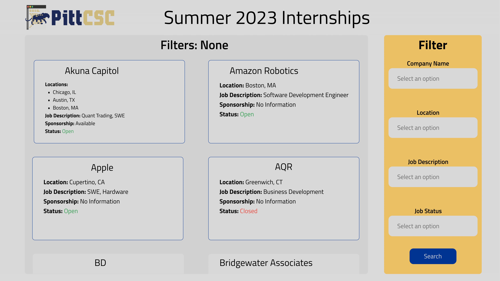

# CSC Hacks 2022

## Project Description
- The purpose of this project is to make a user-friendly and interactable website for the CSC Internship Repository.
- We plan on using React for the front end, Express/Node JS for the backend, and MongoDB hosted on AWS to act as a database.

### Here's the FIGMA model of what we hope to achieve

## Team Information
Steven Jarmell
- sjj27@pitt.edu

Jonah Osband
- jro44@pitt.edu

Sam Herbst
- srh104@pitt.edu
